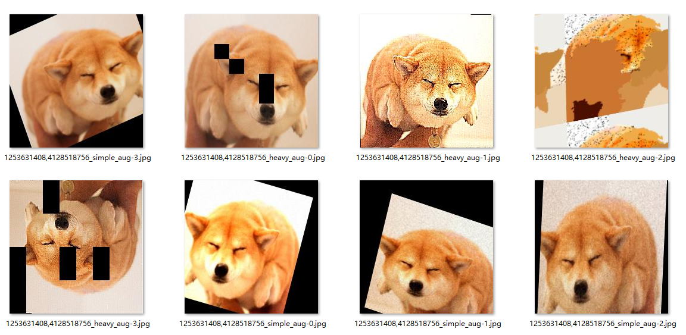
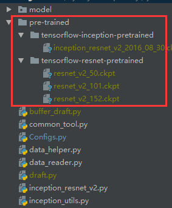
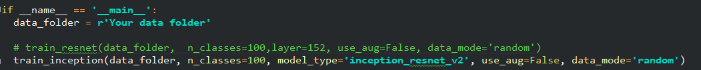
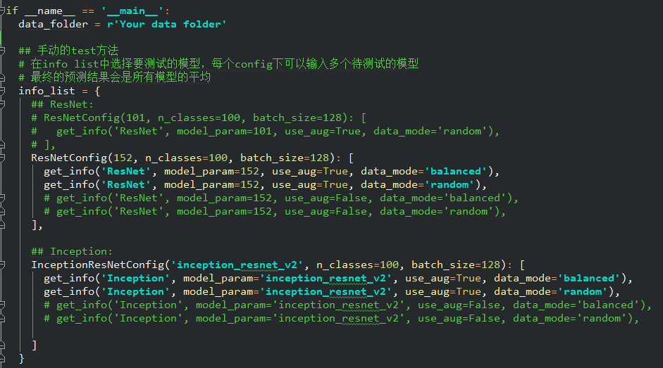
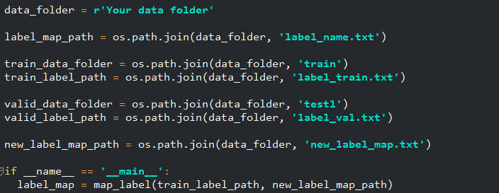
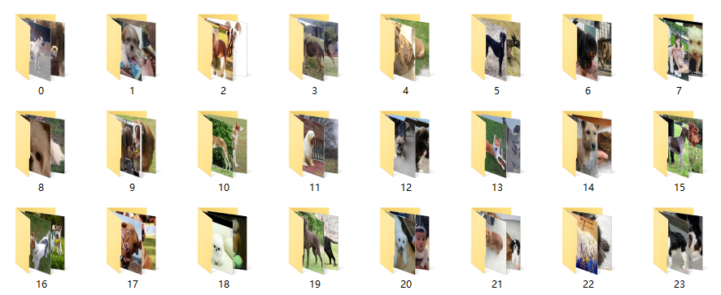
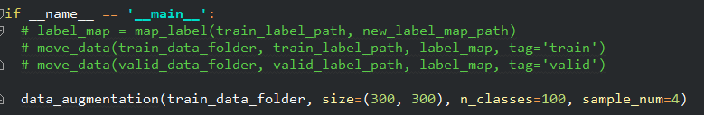
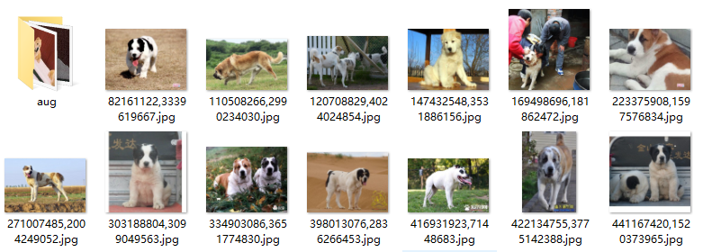

## 宠物狗品种识别

此项目是"宠物狗品种识别"的轻量级实现。此项目旨提供最经济、最快捷、最具性价比的图像分类解决方案。
此任务需要为100种宠物狗进行品种分类。所用数据集包含约8000张图片作为训练集，约10000张图片作为验证集(在此任务中将验证集当测试集来评判模型的性能)。

通过本项目提供的代码，任何人都可以用笔记本在10分钟内完成训练并在验证集(在本任务中也是测试集)上达到76%+的准确率。

\* 此项目提供的代码可快速迁移至其他图像分类任务中。

## 方法概述

此项目的实现基于python3和tensorflow1.2+，核心方法为：

1. **迁移学习**

   传统非神经网络方法或浅层CNN模型几乎不可能在这个任务上取得好的结果；而从零开始训练如Inception、ResNet等深层CNN网络难度极大。本项目提供了基于迁移学习的深度CNN分类模型：使用在ImageNet上充分预训练过的Inception和ResNet模型，截取这些预训练模型从图像中提取出的特征并将其输入自定义的分类网络。训练时保留预训练网络的参数不变，只调整自定义的1-3层全连接分类网络。

   目前可选的预训练模型有：

   * Inception-ResNet-v2
   * ResNet-50-v2
   * ResNet-101-v2
   * ResNet-152-v2

   更多预训练模型请参考：https://github.com/MachineLP/models/tree/master/research/slim

2. **数据增强**

   本项目利用[imgaug](https://github.com/aleju/imgaug)库进行数据增强。数据增强可模拟不同的拍摄场景、增加训练数据量，进而提升分类模型的稳定性。

   原图：
   部分增强结果: 

3. **模型集成**

   结合多个模型的分类结果可以提升分类的准确性，集成模型相较于单模型可以取得约1-3%的提升。

      

   [**为什么ensemble会取得更好的效果**](https://www.zhihu.com/question/29036379/answer/111896096)：

   假设我们有10个样本，真实数据（ground truth）都是1：

   >  样本：1111111111

   我们通过模型A，B，C得到准确度（Accuracy）分别为80%，70%，60%的结果分别为：

   >  A: 1111111100 = 80% accuracy
   >
   > B: 0111011101 = 70% accuracy
   >
   > C: 1000101111 = 60% accuracy

   通过简单的ensemble （majority vote：ABC同时对一个样本进行投票，投票数大于等于2的记为1，否则为0），于是得到结果Z为: 

   >  Z: 1111111101 = 90% accuracy

## 快速训练

1. 下载数据

   连接XXX 提供了预训练模型的具体参数、原始图片及数据增强生成的图片分别经过4种预训练模型之后提的的图像特征。

   下载数据后，将pre-trained文件夹放至代码根目录，如下图：
   

2. 开始训练

   下载数据后，修改train.py中的data_folder并选择一种预训练模型并配置训练选项即可开始训练，耗时约5-10分钟。

    

​	训练选项有：

	* use_aug : 可选值为**Ture**和**False**。它控制是否使用数据增强产生的训练数据。
	* data_mode: 可选值为"**random**"和"**balanced**"。它控制训练时每个batch的数据来源。"**random**"模式表示从所有可用数据中随机挑选数据(每个类别被训练的次数约等于该类别数据的占比)。"**balanced**"模式表示等概率地从每个类别中挑选训练数据(每个类别被训练的次数基本相等)

3. 测试模型
	
	训练完成后，修改test.py中的data_folder并根据已训练模型的参赛配置info_list：
	

## 实验结果

\* 不同层数的ResNet效果类似，其中ResNet-152效果最好，所以ResNet系列仅列出ResNet-152的实验结果。

下表给出了基于预训练Inception-ResNet的网络在本次数据集上的实验结果。

| 模型名称 | UseAug | DataMode | Valid-Acc |
|:----------:|:------:|:-----:| :-----:|
|**Inception-ResNet**| True | balanced | **0.7622** |
|				| True |random| 0.7596 |
|				|False | balanced| 0.7540  |
|				|False | random|0.7426 |

下表给出了基于预训练ResNet-152的网络在本次数据集上的实验结果。

| 模型名称 | UseAug | DataMode | Valid-Acc |
|:----------:|:------:|:-----:| :-----:|
|**ResNet-152**| True | balanced | **0.7458** |
|				| True |random| 0.7443  |
|				|False | balanced| 0.7420   |
|				|False | random|0.7425  |

下表给出了简单集成ResNet-152和Inception-ResNet之后得到的实验结果。
可以看到模型集成之后最高的acc从0.7622提升到了0.7716, 而且最差的两个单模型(0.7426和0.7425)集成之后也能达到0.7677的acc, 超过最佳的单模型acc(0.7622)。

|IncepResNet\ResNet-152	| Aug-balanced | Aug-random | NoAug-balanced |NoAug-random|
|:----------:|:------:|:------:| :------:| :------:|
|**Aug-balanced**| 0.7707 | **0.7716** | 0.7686 |0.7694 |
|**Aug-random** | 0.7695 |0.7684 |0.7661 |0.7679 |
|**NoAug-balanced** |0.7711 |0.7706 |0.7680 |0.7687 |
|**NoAug-random**|0.7678 |0.7712 |0.7656 |0.7677 |

## 从零开始训练

1. 标签映射

   原始数据中的"label_name.txt"包含了134种类别，虽然训练集和验证集的类别总共只有100种，但是其标签id并不是连续的，所以首先需要将数据中的标签映射至0-99。

   

   下载链接：https://pan.baidu.com/s/1MlhMmeCM5Ta_hOsRy3jJxg 密码：2nhh 中的数据，并解压**train.tar**和**val.tar**至当前目录。

   进入**data_helper.py**, 修改**data_folder**为你存储数据的根目录，然后执行**label_map**方法。

   

2. 按标签类别移动数据

   然后执行move_data将数据移动进对应类别的文件夹中：

   

   效果：

   

3. (可选)进行数据增强

   在**data_helper.py**下配置**data_augmentation**可进行数据数据增强。

   

   其中size表示增强产生的数据的大小。sample_num表示要通过增强产生的图片数量。

   数据增强完成后，每个类别文件夹内会产生一个"aug"文件夹，其中存储了通过数据增强产生的所有图片：

   

4. 准备cache并开始训练

   从连接XXX下载预训练模型的参数pre-trained文件夹，并将其放至代码根目录，如下图：

   

   修改**train.py**中的data_folder并选择一种预训练模型并配置训练选项即可开始训练。

   此过程会经历两个阶段：

   * 制作cache

     大致流程为：加载预训练模型，将图片输入预训练模型并提取特征，最终将提得的特征存储为cache文件。此过程在**GPU**上耗时约30-60分钟, 在**CPU**上耗时约5-10小时。

     每个预训练模型的cache只需制作一次。

   * 开始训练

     cache制作完成之后便会自动开始训练。

